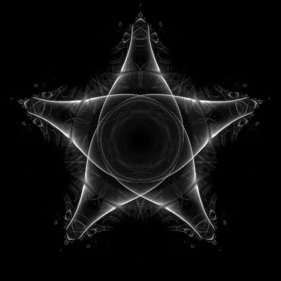

# Fine fractals zoom videos

### Java project to make fine fractal zoom videos

## Finebrot

In fine fractals we are interested in all intermediate results for a specific calculation, for example z<sup>2</sup>  
All these intermediate results form a **calculation path**.

This app computes at least one calculation path for each pixel of Mandelbrot domain.

All these **calculation paths together** are what makes the **Finebrot fractal**.




A mathematician might call generated Finebrot an **orbital density map**

## Mandelbrot

Represents Mandelbrot fractal, it is used to maintain interesting points for fine fractal computation.

All the interesting points are at the horizon of Mandelbrot set.

In Mandelbrot window, they are shown in `red` color.

## Variables

`px`, `py` - numbers represent `int` x,y coordinates of screen pixels

`re`, `im` - numbers represent `double` x,y coordinates (point), located in the center of a pixel

`m` - carrier object for effective calculation

## Java made video with audio from list of generated images

Click to watch on YouTube

[](https://youtu.be/7SpfYgG9m6M)

https://youtu.be/7SpfYgG9m6M

## Mandelbrot calculation

For each pixel `px`,`py`, take point in the center of that pixel `re`,`im`, call it **origin**.

Start calculation below, and repeat it, for at most `ITERATION_MAX` times, or until the calculation result diverges.   
(see `CALCULATION_BOUNDARY`)

> re -> (re * re) - (im * im) + originRe  
> im -> 2 * re * im + originIm

For each specific pixel `re` and `im` jumps around in spirals as calculation progresses,  
`originRe`, and `originIm` are constant.

In deliberately confusing terminology of complex numbers

> z -> z<sup>2</sup> + c

Where c is a constant, which is different for each calculation origin, and z<sub>0</sub> = c<sub>0</sub>

### To make a classic image of Mandelbrot set

Count how many iteration it took, for the calculation to diverge.

Pixels, for which the calculation didn't diverge, that is `ITERATION_MAX` was reached, those color **black**.

Those pixels for which the calculation diverged after at least `ITERATION_min`, but before `ITERATION_MAX`
calculation iterations, those color with various **bright colors**.

## Finebrot calculation

Calculation is the same

> re -> (re * re) - (im * im) + originRe  
> im -> 2 * re * im + originIm


but we are interested in each point of the **calculation path**.

That is calculation `path`, represented as `ArrayList<double[]> path`

### To make an image

For each path element [re<sub>i</sub>, im<sub>i</sub>] increase value of corresponding pixel by one.

Color the resulting values by **decent colors**.

## CPUs consumption

All mathematical calculations happen in `CalculationPathThread` which computes calculation paths for
each `MandelbrotElement`

`ExecutorService` uses N-1 CPU cores.

It takes only seconds to generate decent image or video frame on good CPU.

Full zoom video or 10k resolution image may take 24h+

## Memory consumption

Finebrot fractal is held in computer memory as individual calculation paths.

All calculation paths are held in memory because as the zoom progresses,   
path elements re<sub>i</sub>, im<sub>i</sub> move to new screen pixels xp,py.

Path elements re,im which move out of the screen boundary are removed. But there is still plenty of data in memory.

For **full HD** video it is **recommended** to have at least **16GB RAM**.

To save memory set `RESOLUTION_MULTIPLIER = none`.


## How to make Video from images with sound

In package `.tools.video` is ready to use `ListOfImagesToVideoWithAudio`

Which will combine generated list of images with audio file to make a video.

Edit constants annotated with `@EditMe` to point to your image directory and audio file.

Library used to generate video with sound in Java is `org.bytedeco.ffmpeg`

## Application overview

`fine.fractals`

Root package contains Classes representing specific fractals.

These classes contain the relevant equation `math()` and all the relevant variables.

Definitions of image resolution, color palette, etc.

`fine.fractals.color`

Contains color palettes used to perfectly color generated Finebrot data into image.

`fine.fractals.fractal.finebrot`

Area - defines which part of Finebrot is displayed and calculated

Paths - holds all the calculation paths data `ArrayList<double[]> paths`

Pixels - holds the `double[]` data mapped to `int[]` screen pixels

Packages `.finite.`, `.infinite.`, `.euler.`, `.phoenix.`

Contains implementations for various kinds of fractals this application can calculate.

`fine.fractals.fractal.mandelbrot.`

Area - defines domain for Finebrot calculation, all the interesting pints are at the horizon of Mandelbrot set.

Pixels - holds the Mandelbrot data `MandelbrotElement[RESOLUTION_WIDTH][RESOLUTION_HEIGHT]`    
Which contain relevant Mandelbrot pixel states. These states are important to optimize calculation.

`fine.fractals.machine.`

`FractalEngine` - Fractal engine sequentially triggers the calculation and organizes relevant
steps before and after the calculation.  
It is the centre functional core of this application.

`CalculationPathThread` - Performs the actual calculations for `MandelbrotElements` and
puts good results (calculation paths) in `PathsFinebrot`

`Target` - represents point `re,im` at the center of displayed `AreaFinebrot` and `AreaMandelbrot`   
Towards this point the application zooms

## How to use this application

* In IDE, navigate to any fine fractal in root package, for example `fine.fractals.Finebrot_Side`
* See the few constants which configure the application.
* Execute `main` method.

## Contributions are welcomed

```
https://github.com/rusty-brown/fine-fractals-zoom-videos.git
```

## Random ideas to do

Make fine fractal from Riemann Zeta function and zoom into -1/12

Redo area Mandelbrot, don't make it smaller each zoom, only recalculate `plank` and cut area borders
when elements on sides don't add any relevant data.

Optimize `ITERATION_MAX` and `ITERATION_min` by small finebrot chunks, not by the whole screen data.
